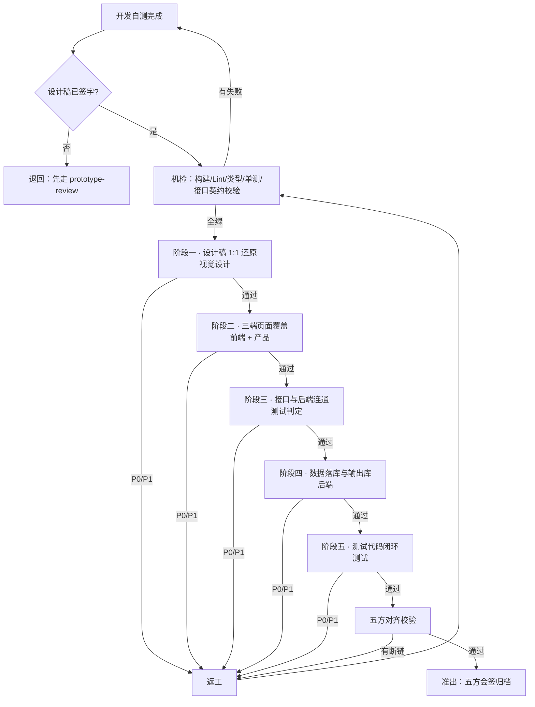

# 开发交付闭环验收检查机制

> **适用对象**：三端代码（移动端 / 官网 / 运营管理系统）与后端服务**开发完成之后**的验收。
> **不适用**：需求前期调研、产品架构决策、线上运维与监控告警。
>
> **上游**：设计稿侧的验收走 `prototype-review.md`（四阶段闭环检查，随 `pm-master` / `pm-prd-spec` 分发）。
> **设计稿未签字的，本检查不受理**——拿一份自己都没走通的稿去比对代码，比不出任何结论。
> 只装了研发链、手上没有那份文件时，本条**降级为**：设计稿必须已由产品与测试书面确认
> 「每条业务流程的每个节点都有页面、且都点得通」，**这个前置不因缺文件而豁免**。
>
> **本文件在 `dev-master` 与 `dev-fullstack-product` 两个技能下各有一份完全相同的副本**（bundle 要能独立安装）。
> 改其中一份**必须**同步另一份。

---

## 0 这套机制要解决的问题

开发交付验收最常见的失败不是"功能没做"，而是**四种"看起来通了"**：

| 假通过形状 | 典型表现 | 为什么验收时发现不了 |
| --- | --- | --- |
| **像素级偏差累积** | 每处差 3–5px、色值差一档、字重差一级 | 单页看"差不多"，三端拼起来就是两套产品 |
| **接口 200 ≠ 数据落库** | 返回成功、库里没有；或写了主表没写从表；或事务回滚了但接口已返回成功 | **只验接口不验库**，是本检查里最贵的一条 |
| **一端通推定全端通** | 同一个接口移动端通了，官网的分页参数没传、后台的批量入参没校验 | 验收只挑一端演示 |
| **测试只覆盖 happy path** | 用例全绿，异常流一条没写；或用例互相依赖，单跑必挂 | 覆盖率数字好看，回归时才崩 |

因此本机制的核心判据是**五层递进**，上一层不通过不进下一层：

```
① 还原  代码页面与设计稿是否 1:1
     ↓
② 覆盖  三端页面清单与设计稿是否双向无偏差
     ↓
③ 连通  前端每一次调用与后端每一个接口是否全链路对得上
     ↓
④ 落库  每一个写操作在库里是否真的留下了正确的行与字段
     ↓
⑤ 闭环  测试代码能否从入口走到终态并断言终态，异常可恢复可重试可回滚
```

**贯穿全程的一条铁律**：

> **一切判定以证据为准，不以结论为准。**
> 「已完成」「已联调」「已测试」**不构成**通过。每条通过项**必须**附带本文件规定的证据形态
> （截图 / 录屏 / 请求与响应报文 / SQL 查询结果 / 测试报告），**禁止**以口头或文字结论结案。

---

## 1 角色与职责分工

| 角色 | 检查什么 | 证据形态 | 签字权 |
| --- | --- | --- | --- |
| **视觉设计**（UI） | 阶段一：像素级还原。布局、栅格、间距、字号字重、色值、圆角、阴影、图标切图、空态图、动效 | 设计稿与实现的**叠图对比**（差异图）+ 取色截图 | **阶段一准出签字** |
| **前端工程师**（FE） | 阶段二：三端页面清单双向映射；阶段三前端侧：调用点、入参构造、出参消费、错误码分支、Token 刷新、重试 | 页面映射表 + 浏览器/抓包工具的**请求与响应报文** | 阶段二会签 |
| **后端工程师**（BE） | 阶段三后端侧：接口契约实现、鉴权、幂等、分页排序筛选、超时；阶段四：表结构、事务边界、落库结果、缓存一致性、审计日志 | 接口自测报文 + **SQL 查询结果截图/文本** + 表结构 DDL | **阶段四准出签字** |
| **测试工程师**（QA） | 阶段三联调判定；阶段五：用例分层、正常/异常/边界覆盖、断言完整性、可重跑、覆盖率、CI 回归 | 逐接口「通/不通」表 + **测试报告 + 覆盖率报告 + CI 运行链接** | **阶段三、五准出签字** |
| **产品专家**（PM） | 全程：业务语义是否与 PRD/SRS 一致；三方对齐（§8）是否成立；变更是否同步了其余四方 | 五方映射表 | **终验签字** |

**签字规则**：

- 每个阶段**必须**由该阶段责任人签字后才能进入下一阶段。
- **禁止**开发者自己签自己实现部分的验收字——**写代码的人不能签自己的通过**。
- 阶段三的「通/不通」**必须**由测试工程师判定，前后端只提供证据，**不参与判定**。
- 产品专家的终验签字**必须**在其余四方签完之后，**禁止**并签。
- 任何一方**可以**对已签字阶段提出复议；复议成立则该阶段及其后所有阶段**必须**重新签字。

---

## 2 检查流程总览



| 阶段 | 输入 | 动作 | 输出 | 准出条件 |
| --- | --- | --- | --- | --- |
| **机检** | 代码仓库 | 构建 / Lint / 类型 / 单测 / 接口契约校验 | CI 报告 | **全绿** |
| **一** | 已签字设计稿 + 运行中的页面 | 逐页逐区块逐状态叠图比对 | 《还原差异表》 | 无 P0/P1 |
| **二** | 设计稿页面清单 + 代码路由表 | 双向映射 | 《三端覆盖表》 | 双向无偏差 |
| **三** | 接口契约（OpenAPI/SRS） | 逐接口逐端真调 | 《接口连通表》 | 每接口每端「通」 |
| **四** | 表结构 DDL + 写操作清单 | 逐写操作查库验证 | 《落库验证表》 | 每写操作有 SQL 证据 |
| **五** | 测试代码仓 | 分层检视 + 真跑 | 《测试闭环表》+ 覆盖率 | 达阈值且异常流覆盖 |
| **对齐** | 以上全部 | 五方映射 | 《五方映射表》 | 无断链 |
| **准出** | 以上全部 | 五方会签 | 归档包 | 见 §10 |

**返工后必须从机检重跑**，**禁止**只复验单点。

---

## 3 阶段一 · 设计稿 1:1 还原检查

### 3.1 方法

**必须**用叠图比对（设计稿导出图与实现截图同尺寸叠加、取差异），**禁止**肉眼并排看。
比对**必须**逐页面 × 逐区块 × 逐状态三维展开——**一个页面的一个区块在一种状态下算一个检查单元**。

**状态维度至少包含**：默认 / hover / focus / active / disabled / 选中 / 错误 / 加载 / 空 / 超长内容。

### 3.2 判据（全部为硬数值，禁止形容词）

| 检查项 | 判据 | 不通过示例 |
| --- | --- | --- |
| **布局与栅格** | 列数、栏宽、槽宽与设计稿**完全一致**；容器最大宽度偏差 **= 0** | 12 栅做成 10 栅 |
| **间距** | 单处偏差 **≤ 2px**；**同一页累计出现 > 3 处 2px 偏差即判不通过**（累积会肉眼可辨） | 卡片内边距 16 → 20 |
| **字号** | **完全一致**（偏差 = 0） | 14px 做成 15px |
| **字重** | **完全一致**（400/500/600/700 不得就近取） | 600 做成 bold(700) |
| **行高** | 偏差 **≤ 1px** 或与设计稿倍数一致 | 1.5 做成 normal |
| **字间距** | **完全一致** | letter-spacing 丢失 |
| **色值** | 与设计稿 **HEX 完全一致**（含透明度 alpha）；**必须**取自设计令牌而非手写 | `#1A1A1A` 写成 `#111` |
| **圆角** | **完全一致**（偏差 = 0），四角不一致时逐角核 | 8px 做成 6px |
| **阴影** | x / y / blur / spread / 色值 / alpha **五项完全一致** | 用组件库默认阴影顶替 |
| **边框** | 宽度、样式、色值**完全一致**；1px 在高 DPR 下**必须**仍为 1 物理像素表现 | 1px 被渲染成 2px |
| **图标** | 用设计稿同一套源文件；尺寸、线宽、视觉重心**完全一致**；**禁止**用相近图标顶替 | 用组件库图标替代定制图标 |
| **切图/图片** | 分辨率满足 2x/3x；**禁止**拉伸变形；`object-fit` 与设计稿裁切一致 | 用 1x 图放大 |
| **空态图** | 图、主文案、副文案、按钮**四件齐全**且与设计稿一致 | 只有一行"暂无数据" |
| **动效时长** | 偏差 **≤ 30ms** | 200ms 做成 400ms |
| **缓动曲线** | **完全一致**（`cubic-bezier` 四个值逐位比对；**禁止**用 `ease` 顶替具名曲线） | 自定义曲线换成 ease-in-out |
| **响应式断点** | 断点值**完全一致**；每个断点下的布局变化与设计稿一致 | 768 做成 767 |
| **暗色/多主题** | 每个主题下所有色值**逐一核**；**禁止**只核浅色档 | 深色档对比度不达标 |

### 3.3 三条必查规则

**D1 · 色值必须来自令牌。** 实现里出现**硬编码色值**即判不通过（即使数值正确）——下次改主题会漏。
判据：`grep` 样式源码中的裸 HEX/RGB，命中数**必须为 0**（设计令牌定义文件除外）。

**D2 · 超长内容必须核。** 每个文本区块**必须**用 2 倍于设计稿示例长度的内容再核一遍：
截断 / 换行 / 省略号规则**必须**与设计稿一致，**禁止**出现撑破布局、遮挡、重叠。

**D3 · 组件库不得覆盖设计。** 用了 UI 组件库时，**必须**逐项确认组件默认样式已被设计令牌覆盖。
判据：随机抽 5 个组件，其间距/圆角/色值/字重四项**必须**取自令牌而非组件库默认值。

### 3.4 阶段一准出

- 《还原差异表》无 P0/P1；
- 每条通过项有**叠图差异截图**为证；
- 视觉设计签字。

---

## 4 阶段二 · 多端页面覆盖检查

### 4.1 双向映射（两个方向都必须为空）

| 方向 | 判据 | 处置 |
| --- | --- | --- |
| **设计稿有、代码无** | 数量**必须 = 0** | 属漏做，**必须**当轮补齐 |
| **代码有、设计稿无** | 数量**必须 = 0** | 属私自加页，**必须**回补设计稿并重走阶段一，或删除 |

**禁止**以"这页很简单不用设计稿"结案——没有设计稿的页面无法验收还原，等于不可验收。

### 4.2 三端各自必查

**移动端（H5 / 小程序 / App）**

- [ ] 页面清单与设计稿移动端墙一一对应；
- [ ] 底部 Tab / 返回栈：每个 Tab 指向正确，返回**必须**回上一层而非首页；
- [ ] 安全区适配（刘海、底部横条）；横竖屏（若支持）；
- [ ] 小程序：tabBar 配置、页面路径注册、分包、包体积上限；
- [ ] App：推送跳转落地页、深链（Deep Link）、系统权限申请时机与拒绝后表现；
- [ ] H5：微信内置浏览器、Safari、Chrome 三处各验一次。

**官网（PC 与响应式）**

- [ ] 每个断点（至少 1920 / 1440 / 1024 / 768 / 375）下逐页核；
- [ ] SEO：`title` / `description` / `og:` 标签 / 语义标签 / `h1` 唯一；
- [ ] 锚点导航、页内跳转、外链 `rel` 属性；
- [ ] 表单留资：校验、提交、成功与失败态。

**运营管理系统**

- [ ] 左侧菜单树层级、命名、折叠态与设计稿一致；
- [ ] **权限菜单**：按角色逐一登录核对——**无权限的菜单必须不渲染**（而非渲染后点击报错）；
- [ ] 表格：列定义、列宽、排序、筛选、分页、空态、加载态、行操作、批量操作；
- [ ] 表单：字段、校验规则与提示文案、必填标记、禁用态、只读态；
- [ ] 弹窗/抽屉：同时只允许一层、`Esc` 与点遮罩的关闭行为与设计稿一致；
- [ ] 危险操作二次确认层的五项摘要（对象/范围/生效时间/影响面/可否撤销）。

### 4.3 跨端一致性

同一业务对象在三端的**字段名、状态枚举、文案、时间格式、金额格式**必须一致。
判据：任取 3 个业务对象，五项逐一比对，**不一致数必须为 0**。

### 4.4 阶段二准出

- 《三端覆盖表》双向偏差为 0；
- 权限菜单按角色逐一验过；
- 前端工程师 + 产品专家会签。

---

## 5 阶段三 · 接口与后端连通性检查

### 5.1 判定单元

**一个接口 × 一个调用端 = 一个判定单元。**

> **禁止**以一端通过推定其余端通过。同一个 `GET /api/order/list`，移动端传 3 个参数、
> 后台传 9 个参数（含批量筛选与排序），是**两个判定单元**。

### 5.2 逐接口必查项

| 维度 | 判据 |
| --- | --- |
| **路径与方法** | 与契约（OpenAPI / SRS）**完全一致**，含大小写与复数形式 |
| **入参** | 字段名、类型、必填性、默认值、取值范围与契约一致；**必须**验证缺参、多参、类型错误三种情况的返回 |
| **出参** | 字段名、类型、嵌套结构、空值表示（`null` vs `""` vs 缺字段）与契约一致 |
| **字段类型** | 数值精度（金额**禁止**用浮点）、时间格式（时区、ISO8601）、布尔表示、枚举值 |
| **状态码** | 成功 2xx；参数错 4xx；无权 401/403；不存在 404；冲突 409；服务错 5xx。**禁止**一律返回 200 靠 body 里的 code 区分 |
| **业务错误码** | 每个错误码**必须**在契约里有定义，且前端**必须**有对应分支（**禁止**只做一个"系统繁忙"兜底） |
| **鉴权** | 未带 Token、Token 过期、Token 无权限三种情况**必须**分别验证并返回不同码 |
| **Token 刷新** | 过期时静默续期一次；续期失败**必须**跳登录并记住原目标；**禁止**无限重试 |
| **超时与重试** | 超时阈值与契约一致；**只有幂等接口允许自动重试**；重试次数与退避策略明确 |
| **幂等** | 写接口**必须**有幂等键；同一幂等键重复提交**必须**返回同一结果且**只产生一条数据**（阶段四查库验证） |
| **分页** | 页码/游标语义、`total` 口径、越界页、首页与末页、`pageSize` 上限 |
| **排序** | 字段白名单、多字段排序、稳定性（等值时顺序固定） |
| **筛选** | 单条件、多条件组合、空条件、非法值；**必须**验证 SQL 注入防护 |
| **文件上传** | 类型白名单、大小上限、超限提示、断点续传（若有）、上传失败清理 |
| **文件下载** | 权限校验、大文件流式、文件名编码（中文名）、过期链接 |
| **跨域与网关** | CORS 配置、预检请求、网关路由前缀、限流阈值与触发后的返回 |
| **环境一致性** | 测试 / 预发 / 生产三套环境的**契约必须一致**；配置差异**必须**只在配置项不在代码分支 |

### 5.3 证据要求

每个判定单元**必须**留存：

| 证据 | 要求 |
| --- | --- |
| 请求报文 | 完整 URL + method + headers（脱敏后）+ body |
| 响应报文 | 完整 body + status code |
| 耗时 | 毫秒数；**超过契约阈值即判不通过** |
| 调用端 | 移动端 / 官网 / 后台，明确标注 |
| 环境 | 测试 / 预发 |

**禁止**以"接口已联调"结案，**禁止**只截一张控制台 Network 面板的列表图（看不到 body）。

### 5.4 判定

《接口连通表》每行只有 `通` / `不通` 两个值。**禁止**填「部分通」「待确认」。
出现「部分通」的情形**必须**拆成多行（按调用端或按场景拆）。

### 5.5 阶段三准出

- 每个「接口 × 端」单元均为 `通` 且有四类证据；
- 业务错误码前端分支覆盖率 100%；
- 测试工程师签字。

---

## 6 阶段四 · 数据落库与输出库检查

### 6.1 铁律

> **禁止只验接口返回不验数据库。**
> 接口 200 与数据正确落库是两件事。每一个写操作（新增 / 更新 / 删除 / 批量）
> **必须**给出对应的库、表、字段与 **SQL 查询结果**作为证据。

三种必须靠查库才能发现的失败：

1. **返回成功但库中无数据**（事务回滚了、异步队列丢了、写了缓存没写库）；
2. **主表写了从表没写**（订单有、订单项无）；
3. **写进去了但字段不对**（金额精度丢失、时间存成了本地时区、枚举存了字面量而非码值）。

### 6.2 表结构检查

| 检查项 | 判据 |
| --- | --- |
| **表结构与详细设计一致** | 表名、字段名、顺序与 LLD/SRS **完全一致** |
| **字段类型与长度** | 与设计一致；**金额必须用 `DECIMAL`**，**禁止** `FLOAT`/`DOUBLE`；字符串长度足够（按最长业务值 × 2 核） |
| **必填与默认值** | `NOT NULL` 与业务必填一致；默认值与设计一致；**禁止**用空字符串代替 `NULL` 表示"未填" |
| **主键与唯一键** | 主键策略明确；业务唯一约束**必须**落到数据库唯一索引，**禁止**只靠应用层判重 |
| **索引** | 每个高频查询条件有覆盖索引；**必须**用 `EXPLAIN` 证明未全表扫描 |
| **外键与级联** | 外键存在与否与设计一致；级联删除/更新策略明确；**禁止**出现悬挂引用 |
| **软删除** | 软删字段命名统一；**所有查询必须过滤软删记录**（判据：随机抽 5 个查询，逐一确认） |
| **时间戳** | `created_at` / `updated_at` 存在且自动维护；时区统一（**建议** UTC 存储、展示层转换） |
| **幂等键** | 写接口对应的幂等键字段存在且有唯一索引 |
| **审计字段** | `created_by` / `updated_by` 与业务要求一致 |

### 6.3 写操作逐个验证

对**每一个**写操作填写：

| 列 | 要求 |
| --- | --- |
| 操作名 | 如「创建订单」 |
| 触发入口 | 哪个端的哪个按钮 |
| 接口 | `POST /api/order/create` |
| 影响表 | 全部列出（主表 + 从表 + 关联表 + 日志表） |
| 验证 SQL | **必须**给出可复制执行的语句 |
| 执行结果 | **必须**贴结果（行数 + 关键字段值） |
| 判定 | 通 / 不通 |

**必须**验证的四类场景：

1. **新增**：行数 +1；所有字段值与入参一致；自动字段（ID、时间戳）已生成。
2. **更新**：目标行被改；**未涉及的字段未被误改**（这一条最常漏）；`updated_at` 已刷新。
3. **删除**：软删则标记位翻转且查询已过滤；硬删则行数 -1 且关联数据按级联策略处理。
4. **批量**：全部成功时数量正确；**部分失败时的事务行为与设计一致**（全回滚 or 部分提交，二选一并明确）。

### 6.4 事务与一致性

| 检查项 | 判据 |
| --- | --- |
| **事务边界** | 一个业务动作涉及的多表写**必须**在同一事务内；**必须**构造一次中途失败，验证全部回滚 |
| **幂等** | 同一幂等键连发 3 次，库中**必须**只有 1 条 |
| **并发** | 两个请求同时改同一行，**必须**验证锁或版本号生效，无脏写 |
| **缓存与库一致** | 写操作后缓存**必须**失效或更新；**必须**验证"改完立刻读"拿到的是新值 |
| **异步落库** | 走消息队列的，**必须**验证消息消费失败后的重试与死信；**禁止**发出即认为成功 |
| **日志与审计** | 关键操作（权限变更、资金、删除）**必须**有审计记录落库，含操作人、时间、前后值 |

### 6.5 阶段四准出

- 每个写操作有 SQL 证据且判定为「通」；
- 事务回滚、幂等、并发、缓存一致四项各有一次实测证据；
- 后端工程师签字。

---

## 7 阶段五 · 测试代码闭环检查

### 7.1 用例分层与职责

| 层 | 测什么 | 不测什么 | 运行要求 |
| --- | --- | --- | --- |
| **单元** | 纯函数、业务规则、边界计算 | 不连数据库、不发网络 | 毫秒级，**必须**可并行 |
| **接口** | 单个接口的入参出参与错误码 | 不跨接口编排 | 连测试库，**必须**自带数据准备与清理 |
| **集成** | 多接口编排出的一个业务动作（下单 = 校验 + 扣库存 + 写单 + 发消息） | 不做 UI | 连测试库与中间件 |
| **E2E** | 用户从入口走到终态的完整路径 | 不做穷举组合 | 连完整环境，**必须**可无人值守跑完 |

**禁止**把接口测试写成"调一次看返回 200"——**必须**断言业务字段与**落库结果**。

### 7.2 覆盖要求

每个业务用例**必须**覆盖三类，缺一即不通过：

| 类 | 要求 |
| --- | --- |
| **正常流** | 从入口走到终态，**并断言终态**（不是断言中间返回） |
| **异常流** | 每个已定义的业务错误码至少一条；且**必须**验证异常后**可恢复**（重试成功 / 回滚干净 / 状态可继续） |
| **边界值** | 空 / 单条 / 上限 / 超上限 / 极长 / 极短 / 零 / 负数 / 特殊字符 |

**禁止**只覆盖 happy path。判据：任取 5 个业务用例，逐一检查三类是否齐全。

### 7.3 用例质量

| 检查项 | 判据 |
| --- | --- |
| **断言完整性** | 每条用例**必须**断言：状态码 + 关键业务字段 + **落库结果**；**禁止**只断言"无异常" |
| **独立可重跑** | 任一用例**必须**能单独执行通过，且**连跑两次结果一致**；**禁止**用例间依赖执行顺序 |
| **数据准备与清理** | 每条用例自建所需数据、跑完清理；**禁止**依赖库里已有的"某条历史数据" |
| **Mock 与真实切换** | Mock **必须**可通过配置整体切到真实接口；**禁止**把 Mock 写死在业务代码里 |
| **Mock 契约同步** | Mock 返回结构**必须**与真实契约一致；契约变更时 Mock **必须**同步（用契约文件生成最佳） |
| **测试数据脱敏** | **禁止**使用生产真实用户数据 |
| **命名与可读** | 用例名**必须**说明"在什么条件下、做什么、期望什么" |

### 7.4 覆盖率与 CI

| 项 | 阈值 |
| --- | --- |
| 核心业务模块行覆盖率 | **≥ 80%** |
| 核心业务模块分支覆盖率 | **≥ 70%** |
| 关键路径（资金 / 权限 / 数据删除） | **= 100%** |
| 整体行覆盖率 | **≥ 60%** |

- CI **必须**在每次 push 与 PR 自动触发；
- 测试失败**必须**阻断合并，**禁止**"先合了再修"；
- **必须**产出可访问的回归报告（通过/失败/跳过 + 失败详情 + 耗时）；
- **跳过（skip）的用例必须有原因注释与负责人**，数量**必须**逐轮下降。

### 7.5 阶段五准出

- 四层用例齐备，三类覆盖齐全；
- 覆盖率达阈值且有报告链接；
- CI 全绿且回归报告归档；
- 测试工程师签字。

---

## 8 五方对齐校验：设计稿 ↔ 页面 ↔ 接口 ↔ 表 ↔ 用例

### 8.1 映射表模板（**每个业务功能一行，禁止留空**）

| 功能 | 设计稿页面 | 代码页面/路由 | 接口 | 数据表 | 测试用例 | 对齐 |
| --- | --- | --- | --- | --- | --- | --- |
| 提交订单 | `app-12-checkout.html` | `/checkout`（移动）<br/>`/order/confirm`（官网） | `POST /api/order/create` | `t_order`<br/>`t_order_item` | `TC-ORD-001~012` | ✅ |
| 订单详情 | `app-13-order-detail.html` | `/order/:id` | `GET /api/order/detail` | `t_order` | `TC-ORD-020~026` | ✅ |
| 订单管理 | `admin-a21-orders.html` | `/admin/orders` | `GET /api/order/list`<br/>`POST /api/order/cancel` | `t_order`<br/>`t_order_log` | `TC-ADM-101~118` | ✅ |

### 8.2 五个方向的断链判据（**全部必须为 0**）

| # | 断链形状 | 判据 | 处置 |
| --- | --- | --- | --- |
| A1 | 设计稿有页面，代码无 | = 0 | 补实现 |
| A2 | 代码有页面，设计稿无 | = 0 | 补设计稿并重走阶段一，或删 |
| A3 | 页面调用了契约里没有的接口 | = 0 | 补契约或改调用 |
| A4 | 契约里有接口，无任何页面调用 | = 0 | 确认是否废弃；保留的**必须**写明用途 |
| A5 | 接口写了表，表结构设计里没有 | = 0 | 补 LLD |
| A6 | 表存在，无任何接口读写 | = 0 | 确认是否废弃 |
| A7 | 接口无对应测试用例 | = 0 | 补用例 |
| A8 | 用例引用了不存在的接口或字段 | = 0 | 修用例 |

### 8.3 变更同步规则

> **任一环节变更，必须在映射表中标记并触发其余四方复核。**

| 变更方 | 必须复核 |
| --- | --- |
| 设计稿改了 | 页面还原（阶段一）、页面覆盖（阶段二）、相关用例 |
| 页面改了 | 与设计稿的一致性、调用的接口、E2E 用例 |
| 接口契约改了 | 全部调用端、Mock、接口用例、若涉及字段则查表结构 |
| 表结构改了 | 读写该表的全部接口、落库验证、数据迁移脚本、相关用例 |
| 用例改了 | 确认是用例错还是实现错——**禁止**为了让用例通过而改断言 |

**最后一条是硬规则**：发现用例失败时，**必须**先判定"是实现错还是用例错"，
判定结论**必须**写进缺陷单。**禁止**在未判定的情况下修改断言使其通过。

---

## 9 问题记录与返工闭环

### 9.1 缺陷分级

| 级别 | 定义 | 处置 |
| --- | --- | --- |
| **P0 · 阻断** | 主流程不可用；数据写错或丢失；资金/权限相关错误；安全漏洞；接口不通导致功能不可达 | **必须**当轮修复；**禁止**上线 |
| **P1 · 严重** | 支线流程不可用；异常流无法恢复；跨端数据不一致；还原偏差导致功能误解；覆盖率未达阈值 | **必须**当轮修复 |
| **P2 · 一般** | 还原偏差不影响理解；文案不一致；非关键接口耗时超标；用例可读性差 | **应当**当轮修复；经五方同意可转下一轮 |
| **P3 · 建议** | 体验优化、代码可维护性建议 | **建议**登记备查，不阻塞准出 |

### 9.2 缺陷单必填字段与证据

| 字段 | 要求 |
| --- | --- |
| 缺陷号 | `B-###` |
| 发现阶段 | 机检 / 一 / 二 / 三 / 四 / 五 / 对齐 |
| 所属功能 | **必须**对应 §8 映射表的行 |
| 端 | 移动端 / 官网 / 后台 / 后端 |
| 复现步骤 | **必须**从入口开始的完整操作序列 + 使用的测试账号与环境 |
| 期望 / 实际 | 两行 |
| **证据** | 按类型强制：还原类→**叠图差异截图**；交互类→**录屏**；接口类→**请求与响应报文**；数据类→**SQL 语句与结果**；测试类→**测试报告片段** |
| 级别 | P0–P3 |
| 判据出处 | 本文件条款号 / SRS 章节号 / 契约字段 |
| 指派 | 责任人 + 期限 |
| 根因 | **必须**填；**禁止**填"已修复"之类的非根因 |
| 影响面 | 是否波及其他功能/端/表 |
| 复验结论 | 复验人 + 通过/不通过 + 复验证据 |

**证据缺失的缺陷单不予受理**，也**不得**据此判定不通过——先补证据。

### 9.3 闭环流程

```
发现 → 登记（含证据与判据出处）→ 定级 → 指派 → 定位根因 → 修复
   → 重跑机检 → 原路径复验（附新证据）→ 影响面抽验 → 更新 §8 映射表 → 关闭
```

**五条硬规则**：

1. **复验必须由发现人做**，**禁止**修复人自行关闭。
2. **复验必须重走完整路径并留新证据**，**禁止**只看修改点、**禁止**复用旧证据。
3. **数据类缺陷的复验必须重新查库**，**禁止**只看接口返回。
4. **影响面涉及其他端的，必须逐端复验**。
5. **返工后必须重跑机检与相关阶段**；改了表结构或契约的，**必须**回到阶段三重走。

### 9.4 归零表

| 项 | 本轮 |
| --- | --- |
| P0 未闭环 | 0 |
| P1 未闭环 | 0 |
| 机检（构建/Lint/类型/单测/契约） | 全绿 |
| 还原 P0/P1 | 0 |
| 页面双向偏差 | 0 |
| 接口「不通」单元 | 0 |
| 写操作无 SQL 证据 | 0 |
| 覆盖率未达阈值模块 | 0 |
| §8 断链 A1–A8 | 0 |
| 证据缺失的通过项 | 0 |

---

## 10 准入准出判定标准

### 10.1 准入（进入本检查前）

**全部满足**才受理，否则**必须**退回：

- [ ] **设计稿已通过 `prototype-review.md` 四阶段检查并签字**；
- [ ] 代码可构建、可部署到测试环境，且**一键部署脚本真跑过一次**；
- [ ] 接口契约（OpenAPI / SRS 接口章节）已落盘且版本与代码一致；
- [ ] 表结构 DDL 已落盘，测试库已按 DDL 建好；
- [ ] 测试账号表齐备（覆盖全部角色与权限组合）；
- [ ] 三端均可访问，且已提供访问地址与账号。

### 10.2 准出（检查通过）

**全部满足**才算通过：

- [ ] 机检全绿；
- [ ] 阶段一至五各自准出条件满足且有证据；
- [ ] §8 五方映射表无断链、无空格；
- [ ] P0/P1 全部关闭并复验通过（附新证据）；
- [ ] 归零表全为 0；
- [ ] 五方会签（视觉、前端、后端、测试、产品）。

### 10.3 必须打回重做

命中**任意一条**即整轮打回，不走返工：

| 情形 | 理由 |
| --- | --- |
| 设计稿未签字就送检 | 基线不成立 |
| 页面双向偏差 ≥ 20% | 实现与设计不是同一份需求 |
| 出现「返回成功但库中无数据」≥ 1 处 | 写链路不可信，逐点修会漏 |
| 测试用例互相依赖、单跑必挂 | 测试资产不可用，等于没有测试 |
| 通过项无证据 ≥ 30% | 验收结论不可追溯 |
| 同一缺陷第三轮仍未修复根因 | 打补丁已被证明无效 |

### 10.4 禁止上线（即使其余项通过）

命中**任意一条**，**禁止**上线：

- **资金相关**：金额用浮点存储、金额计算未用定点数、支付无幂等、退款无审计记录；
- **权限相关**：越权可访问（水平/垂直）、无权限菜单仅前端隐藏而接口未校验；
- **数据相关**：删除无软删或无备份、无数据迁移回滚方案、生产数据未脱敏出现在测试中；
- **安全相关**：SQL 注入/XSS/CSRF 未防护、敏感信息明文传输或明文落库、Token 无过期;
- **可回滚性**：本次变更无回滚方案，或回滚方案未验证过。

---

## 11 检查清单

### 11.1 还原类

| # | 项 | 判据 | 证据 | 结果 |
| --- | --- | --- | --- | --- |
| R01 | 布局与栅格 | 完全一致 | 叠图 | ☐ |
| R02 | 间距 | 单处 ≤2px 且同页 2px 偏差 ≤3 处 | 叠图 | ☐ |
| R03 | 字号 | 偏差 = 0 | 截图 | ☐ |
| R04 | 字重 | 完全一致 | 截图 | ☐ |
| R05 | 行高 / 字间距 | ≤1px / 完全一致 | 截图 | ☐ |
| R06 | 色值（含 alpha） | HEX 完全一致 | 取色图 | ☐ |
| R07 | 色值来自令牌、无硬编码 | 裸 HEX 命中 = 0 | grep 结果 | ☐ |
| R08 | 圆角 | 完全一致 | 叠图 | ☐ |
| R09 | 阴影五项 | 完全一致 | 叠图 | ☐ |
| R10 | 边框（含高 DPR 下 1px） | 完全一致 | 叠图 | ☐ |
| R11 | 图标同源同尺寸线宽 | 完全一致 | 叠图 | ☐ |
| R12 | 切图分辨率与裁切 | 2x/3x 且无变形 | 截图 | ☐ |
| R13 | 空态图四件齐全 | 图+主文案+副文案+按钮 | 截图 | ☐ |
| R14 | 动效时长 | ≤30ms | 录屏 | ☐ |
| R15 | 缓动曲线 | 四值逐位一致 | 代码+录屏 | ☐ |
| R16 | 十种交互状态逐一核 | 全覆盖 | 截图集 | ☐ |
| R17 | 响应式断点值与断点布局 | 完全一致 | 截图集 | ☐ |
| R18 | 多主题逐一核 | 全覆盖且对比度达标 | 截图集 | ☐ |
| R19 | 超长内容不破版 | 2 倍长度仍正确 | 截图 | ☐ |
| R20 | 组件库默认样式已被令牌覆盖 | 抽 5 个组件四项达标 | 代码 | ☐ |

### 11.2 接口类

| # | 项 | 判据 | 证据 | 结果 |
| --- | --- | --- | --- | --- |
| I01 | 路径与方法与契约一致 | 完全一致 | 报文 | ☐ |
| I02 | 入参：字段/类型/必填/默认/范围 | 一致 | 报文 | ☐ |
| I03 | 入参异常三态（缺/多/类型错） | 各有返回且符合契约 | 报文 | ☐ |
| I04 | 出参结构与空值表示 | 一致 | 报文 | ☐ |
| I05 | 数值精度与时间格式 | 金额非浮点、时区统一 | 报文 | ☐ |
| I06 | HTTP 状态码语义正确 | 非全 200 | 报文 | ☐ |
| I07 | 业务错误码契约齐全 | 全部已定义 | 契约 | ☐ |
| I08 | 前端错误码分支覆盖 | 100% | 代码+录屏 | ☐ |
| I09 | 鉴权三态（无/过期/无权） | 分别返回不同码 | 报文 | ☐ |
| I10 | Token 静默续期与失败跳登录回原目标 | 通过 | 录屏 | ☐ |
| I11 | 超时阈值与重试策略 | 仅幂等接口重试 | 报文+代码 | ☐ |
| I12 | 幂等键存在且生效 | 重复提交返回同一结果 | 报文 | ☐ |
| I13 | 分页（越界/首末页/上限） | 通过 | 报文 | ☐ |
| I14 | 排序（白名单/多字段/稳定） | 通过 | 报文 | ☐ |
| I15 | 筛选（组合/空/非法/注入防护） | 通过 | 报文 | ☐ |
| I16 | 文件上传（类型/大小/失败清理） | 通过 | 报文 | ☐ |
| I17 | 文件下载（权限/中文名/大文件） | 通过 | 报文 | ☐ |
| I18 | 跨域/网关/限流 | 通过 | 报文 | ☐ |
| I19 | 三环境契约一致 | 差异仅在配置 | 对比 | ☐ |
| I20 | **每个「接口 × 端」单元单独判定** | 全部「通」 | 连通表 | ☐ |

### 11.3 数据类

| # | 项 | 判据 | 证据 | 结果 |
| --- | --- | --- | --- | --- |
| D01 | 表结构与 LLD 一致 | 完全一致 | DDL | ☐ |
| D02 | 金额用 DECIMAL | 无浮点 | DDL | ☐ |
| D03 | 字段长度按最长值×2 | 达标 | DDL | ☐ |
| D04 | 必填与默认值 | 与设计一致 | DDL | ☐ |
| D05 | 业务唯一约束落到唯一索引 | 存在 | DDL | ☐ |
| D06 | 高频查询有覆盖索引 | EXPLAIN 无全表扫 | EXPLAIN | ☐ |
| D07 | 外键与级联策略 | 与设计一致、无悬挂 | SQL | ☐ |
| D08 | 软删字段 + 所有查询已过滤 | 抽 5 个查询全过滤 | 代码+SQL | ☐ |
| D09 | 时间戳自动维护且时区统一 | 通过 | SQL | ☐ |
| D10 | 幂等键字段 + 唯一索引 | 存在 | DDL | ☐ |
| D11 | **新增**：行数+1 且字段值正确 | 通过 | SQL 结果 | ☐ |
| D12 | **更新**：目标行改、无关字段未误改 | 通过 | SQL 结果 | ☐ |
| D13 | **删除**：软删标记翻转 / 硬删级联正确 | 通过 | SQL 结果 | ☐ |
| D14 | **批量**：数量正确、部分失败行为与设计一致 | 通过 | SQL 结果 | ☐ |
| D15 | 事务边界：构造中途失败验证全回滚 | 通过 | SQL 结果 | ☐ |
| D16 | 幂等：连发 3 次库中仅 1 条 | 通过 | SQL 结果 | ☐ |
| D17 | 并发：无脏写（锁或版本号生效） | 通过 | SQL 结果 | ☐ |
| D18 | 缓存一致：写后立刻读拿到新值 | 通过 | 报文+SQL | ☐ |
| D19 | 异步落库：消费失败可重试、有死信 | 通过 | 日志+SQL | ☐ |
| D20 | 审计落库：操作人/时间/前后值 | 齐全 | SQL 结果 | ☐ |

### 11.4 测试类

| # | 项 | 判据 | 证据 | 结果 |
| --- | --- | --- | --- | --- |
| T01 | 四层用例齐备（单元/接口/集成/E2E） | 全有 | 代码 | ☐ |
| T02 | 每个业务用例含正常流 | 100% | 报告 | ☐ |
| T03 | 每个业务用例含异常流且可恢复 | 100% | 报告 | ☐ |
| T04 | 每个业务用例含边界值 | 100% | 报告 | ☐ |
| T05 | 断言含状态码 + 业务字段 + **落库结果** | 全覆盖 | 代码 | ☐ |
| T06 | 用例单跑通过、连跑两次一致 | 通过 | CI 日志 | ☐ |
| T07 | 用例自建数据并清理，不依赖历史数据 | 通过 | 代码 | ☐ |
| T08 | Mock 可整体切真实接口 | 通过 | 配置 | ☐ |
| T09 | Mock 结构与契约同步 | 一致 | 对比 | ☐ |
| T10 | 测试数据已脱敏、无生产数据 | 通过 | 代码 | ☐ |
| T11 | 用例命名说明条件/动作/期望 | 抽 10 条达标 | 代码 | ☐ |
| T12 | 核心模块行覆盖率 ≥80% | 达标 | 覆盖率报告 | ☐ |
| T13 | 核心模块分支覆盖率 ≥70% | 达标 | 覆盖率报告 | ☐ |
| T14 | 关键路径覆盖率 =100% | 达标 | 覆盖率报告 | ☐ |
| T15 | 整体行覆盖率 ≥60% | 达标 | 覆盖率报告 | ☐ |
| T16 | CI 每次 push/PR 自动触发 | 通过 | CI 配置 | ☐ |
| T17 | 测试失败阻断合并 | 通过 | CI 配置 | ☐ |
| T18 | 回归报告可访问且已归档 | 通过 | 链接 | ☐ |
| T19 | skip 用例有原因与负责人且逐轮下降 | 达标 | 代码+报告 | ☐ |
| T20 | E2E 可无人值守跑完 | 通过 | CI 日志 | ☐ |

### 11.5 会签

| 角色 | 姓名 | 阶段 | 结论 | 日期 |
| --- | --- | --- | --- | --- |
| 视觉设计 | | 一 | 通过 / 不通过 | |
| 前端工程师 | | 二 | 通过 / 不通过 | |
| 测试工程师 | | 三、五 | 通过 / 不通过 | |
| 后端工程师 | | 四 | 通过 / 不通过 | |
| 产品专家 | | 终验 | 通过 / 不通过 | |

---

## 12 样例：订单提交流程

**范围**：移动端下单页、官网结算页、运营后台订单管理页；
接口 `POST /api/order/create`、`GET /api/order/detail`；表 `t_order`、`t_order_item`。

### 12.1 五方映射

| 功能 | 设计稿 | 代码页面 | 接口 | 表 | 用例 |
| --- | --- | --- | --- | --- | --- |
| 提交订单 | `app-12-checkout` / `web-05-checkout` | `/checkout`、`/order/confirm` | `POST /api/order/create` | `t_order`、`t_order_item` | `TC-ORD-001~012` |
| 订单详情 | `app-13-order-detail` | `/order/:id` | `GET /api/order/detail` | `t_order`、`t_order_item` | `TC-ORD-020~026` |
| 订单管理 | `admin-a21-orders` | `/admin/orders` | `GET /api/order/list`、`POST /api/order/cancel` | `t_order`、`t_order_log` | `TC-ADM-101~118` |

### 12.2 阶段一（还原）要点

- 下单页**逐区块**核：商品行、金额区、优惠区、地址区、底部结算条；
- **金额区必须逐状态核**：正常 / 有优惠 / 优惠失效 / 金额为 0 / 金额超 6 位（**破版高发区**）；
- 底部结算条**必须**核安全区适配与吸底行为；
- 按钮四态（默认/按下/禁用/加载）逐一叠图。

### 12.3 阶段三（接口）要点

- `POST /api/order/create` **必须**分「移动端」「官网」两个判定单元——官网多传优惠券与发票参数；
- **必须**验证幂等：同一 `idempotency_key` 连发 3 次；
- **必须**验证库存不足、优惠券失效、地址缺失三个业务错误码，且前端各有分支；
- `GET /api/order/list`（后台）**必须**验证多条件筛选 + 排序 + 分页越界 + `pageSize` 上限。

### 12.4 阶段四（落库）要点

| 操作 | 验证 SQL | 期望 |
| --- | --- | --- |
| 创建订单 | `SELECT * FROM t_order WHERE order_no='X';`<br/>`SELECT count(*) FROM t_order_item WHERE order_no='X';` | 主表 1 行；从表行数 = 购物车条目数；金额 = 明细求和 |
| 幂等 | 同上，连发 3 次后查 | `t_order` 仍为 **1 行** |
| 事务回滚 | 构造扣库存失败后查 | `t_order` **0 行**、`t_order_item` **0 行**（**禁止**主表有、从表无） |
| 取消订单 | `SELECT status,updated_at FROM t_order WHERE ...;`<br/>`SELECT * FROM t_order_log WHERE order_no='X';` | 状态位改、`updated_at` 刷新、**其余字段未误改**、日志表有 1 条含操作人 |
| 金额精度 | `SELECT total_amount FROM t_order WHERE ...;` | `DECIMAL`，`0.1+0.2` 类场景**必须**精确 |

### 12.5 阶段五（测试）要点

- **正常流**：加购 → 结算 → 提交 → 支付 → 成功，**断言终态为「已支付」且库中状态一致**；
- **异常流**：支付失败可重试且**不产生第二条订单**；库存不足时订单**未创建**；
- **边界**：1 件 / 上限件数 / 超上限；金额 0 元；地址超长；
- **E2E**：三端各跑一遍同一业务动作，**禁止**只跑移动端就推定官网与后台通过。

